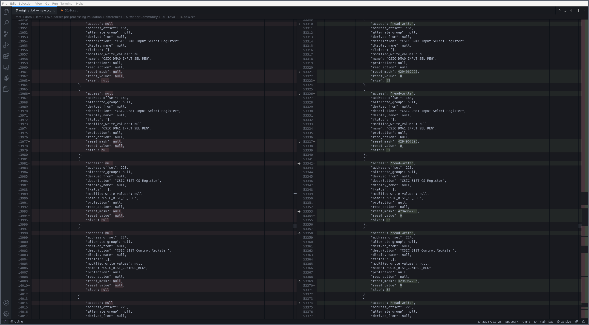

# SVD Parser Pre-Processing Validation

[CMSIS-SVD Repository and Parsers](https://github.com/posborne/cmsis-svd) provides a python package for parsing [SVD files](https://www.keil.com/pack/doc/CMSIS/SVD/html/index.html). [VincentDary](https://github.com/VincentDary) suggested in [PR #172](https://github.com/posborne/cmsis-svd/pull/172) a new pre-processing step to fix some parsing issues. Out of curiosity I created this repository to validate the results of the existing parser (later
on called `original package`) against the results of the applied PR (later on called `new package`).

## How it works

The parsers `SVDParserOriginal` and `SVDParserNew` are executed on all files in directory `data`. If both parsers are successful, the results (converted to dictionaries using `<parser>.get_dive().to_dict()`) are compared. If the results do not match, a corresponding directory is created in directory `differences`, where the dictionaries are stored as `original.txt` and `new.txt`. The results can be compared with Visual Studio Code in diff mode.

### Example of Comparison

```shell
cd ./differences/Allwinner-Community/D1-H.svd
code --diff original.txt new.txt
```



## Applied Changes in Packages

For both, the original and the new package, [PR #176](https://github.com/posborne/cmsis-svd/pull/176) was applied. Without this patch `to_dict()` throws an exception for some SVD files.

## Conclusion

I really like the pre-processing approach and in my opinion it's the way to go. The pre-processing solves multiple issues at once, does not affect the processing time in a noteworthy way, and, based on a random sample validation, works as expected.